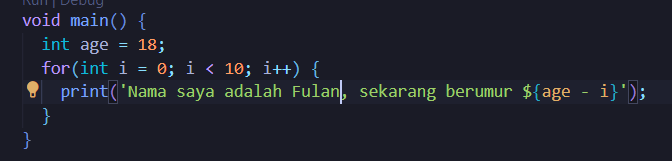
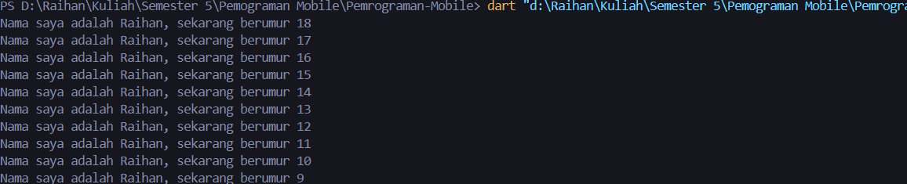

<table>
    <thead>
        <th style="text-align: center;" colspan="2">Pertemuan 2</th>
    </thead>
    <tbody>
        <tr>
            <td>Nama</td>
            <td>Raihan Fazzaufa Rasendriya</td>
        </tr>
        <tr>
            <td>NIM</td>
            <td>2241720201</td>
        </tr>
        <tr>
            <td>Kelas</td>
            <td>TI-3G</td>
        </tr>
        <tr>
            <td>Absen</td>
            <td>22</td>
        </tr>
    </tbody>
</table>

# Minggu 2

# Soal 1

# Modifikasi kode:

# Hasil run:

# Soal 2

Mengapa sangat penting untuk memahami bahasa pemrograman Dart sebelum kita menggunakan framework Flutter ? Jelaskan!
Karena dart merupakan fondasi dari flutter. Flutter menggunakan Dart sebagai bahasa pemrogramannya sehingga sangat penting untuk memahami bahasa pemrograman Dart.

# Soal 3

Rangkumlah materi dari codelab ini menjadi poin-poin penting yang dapat Anda gunakan untuk membantu proses pengembangan aplikasi mobile menggunakan framework Flutter.

**Getting Startet with Dart**

Dart bertujuan untuk menggabungkan kelebihan dari sebagaian besar bahasa tingkat tinggi, antara lain:
- Productive Tooling
- Garbage Collection
- Type Annotations
- Statically typed
- Portability

**Evolution of Dart**

Dart diluncurkan tahun 2011 dengan versi stabilnya pada tahun 2013. Dart kemudian mengalami perubahan besar termasuk rilisnya Dart 2.0 pada tahun 2018 yang dapat diuraikan sebagai berikut:
- Dart awalnya berfokus pada pengembangan web dengan tujuan menggantikan JavaScript.
- Dart mencoba memecahkan masalah pada JavaScript.
- Dart menawarkan performa terbaik dan alat yang lebih baik untuk proyek berskala besar.
- Dart dibentuk agar kuat dan fleksibel.

**How Dart Works**
Cara mengeksekusi kode Dart dapat dilakukan dengan dua cara:
- Dart virtual machine (VMs).
- JavaScript compilations.

compiling Dart menggunakan Dart VM dapat dilakukan secara langsung. Sedangkan apabila menggunakan JavaScript compilations, Dart perlu diubah menjadi JavaScript.

Kode Dart dapat dieksekusi pada lingkungan yang mendukung bahasa Dart. LIngkungan yang mendukung bahasa Dart perlu memperthatikan fitur-fitur penting seperti:
- Runtime systems.
- Dart core libraries.
- Garbage collectors.

Eksekusi kode dart dapat beroperasi dalam dua mode:
- Kompilasi Just-In-Time (JIT) adalah tempat kode sumber dikompilasi sesuai kebutuhan-Just in time. Dart VM memuat dan mengkompilasi kode sumber ke kode mesin asli (native). Pendekatan ini digunakan untuk menjalankan kode pada command line dan dapat memanfaatkan fitur seperti debugging dan hot reload. 
- Kompilasi Ahead-Of-Time (AOT) adalah dimana Dart VM dan kode dikompilasi sebelumnya. Pendekatan ini memiliki keuntungan performa yang sangat besar dibanding JIT namun fitur seperti debugging dan hot reload tidak tersedia.

Hot reloat memungkinkan pengembang untuk mendapatkan umpan balik yang sangat cepat terhadap perubahan kode yang dilakukan, sehingga memungkinkan untuk beralih lebih cepat.

**Introducing the structure of the Dart language**

Dart menyediakan sebagian besar operator standar untuk memanipulasi variabel. built-in types adalah yang paling umum ditemukan dalam bahasa pemrograman tingkat tinggi. Control flow dan function sangat mirip dengan bahasa pemrograman lainnya.

Dart dirancang untuk object oriented (OO). Bahasa OOP didasarkan pada konsep onjek yang menyimpan kedua data dan kode. Sebagian besar desain Object Oriented pada Dart sangat mirip dengan Java.

**Operators**
**arithmetic operator**

+ untuk penambahan
- untuk pengurangan
* untuk perkalian
/ untuk pembagian
~/ untuk pembagian bulat
% untuk operasi modulus
-expression untuk negasi (membalik suatu nilai)

+ dapat digunakan untuk menjumlahkan variabel bertipe num, tetapi juga bisa digunakan untuk menggabung string.
Dart juga menyediakan shortcut operator seperti +=, -=. *=, /=, dan ~/=

**Increment and decrement operators**

++var atau var++ digunakan untuk menambah nilai variabel var sebesar 1.
--var atau var-- digunakan untuk mengurangi nilai variabel var sebesar 1.

**Equality and relational operator**

== untuk memeriksa apakah operan sama.
!= untuk memeriksa apakah operan berbeda.

(>) memeriksa apakah operan kiri lebih besar dari operan kanan.
(<) memeriksa apakah operan kiri lebih kecil dari operan kanan.
(>=) memeriksa apakah operan kiri lebih besar atau sama dengan operan kanan.
(>=) memeriksa apakah operan kiri lebih kecil atau sama dengan operan kanan.

**Logical operators**

Operator logika dari Dart adalah operator yang diterapkan pada operan bool. Operator logika yang disediakan adalah:
!expression negasi atau kebalikan hasil expresi
|| menerapkan logika OR
&& menerapkan logika AND

**Hands-on with Dart**
**DartPad**
Kakas DartPad adalah kakas online yang bagus untuk belajar dan bereksperimen dengan fitur bahasa Dart. Kakas ini mendukung core library Dart, kecuali untuk library VM seperti dart:io.

**Main function**
Dart menggunakan function dan method untuk memisahkan kode. Function main dalam bahasa Dart adalah titik awal eksekusi kode dalam setiap aplikasi Dart. Fungsi main ini wajib ada di setiap aplikasi Dart agar Dart VM tahu di mana harus memulai menjalankan kode.

# Soal 4
link presentasi: 
https://docs.google.com/presentation/d/1d7q8xxtClaH0OCfEMqCnhqRDBf66hBL9/edit#slide=id.p1
