<table>
    <thead>
        <th style="text-align: center;" colspan="2">Pertemuan 2</th>
    </thead>
    <tbody>
        <tr>
            <td>Nama</td>
            <td>Raihan Fazzaufa Rasendriya</td>
        </tr>
        <tr>
            <td>NIM</td>
            <td>2241720201</td>
        </tr>
        <tr>
            <td>Kelas</td>
            <td>TI-3G</td>
        </tr>
        <tr>
            <td>Absen</td>
            <td>22</td>
        </tr>
    </tbody>
</table>

# **Tugas Praktikum**

# Soal 1
Silakan selesaikan Praktikum 1 sampai 3, lalu dokumentasikan berupa screenshot hasil pekerjaan beserta penjelasannya!

# Praktikum 1: Menerapkan Control Flows ("if/else")

**Langkah 1:**

Ketik atau salin kode program berikut ke dalam fungsi main().

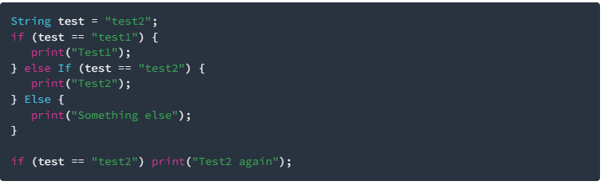

Kode: 

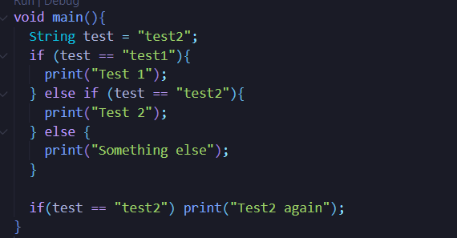

Kode ini adalah kode program sederhana yang menggunakan conditional statement berupa if-else yang bertujuan untuk memeriksa value dari sebuah variabel. (pada kasus ini variabel yang diperiksa adalah variabel test)

**Langkah 2:**

Silakan coba eksekusi (Run) kode pada langkah 1 tersebut. Apa yang terjadi? Jelaskan!

Hasil Eksekusi:

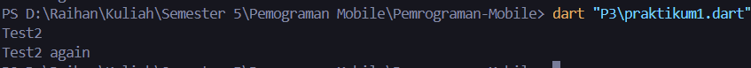

Berdasarkan hasil diatas kondisi yang terpenuhi pada conditional statement adalah kondisi variabel test yang bernilai "test2" sehingga dijalankanlah perintah untuk print tulisan "Test2". Begitu juga dengan kondisi if kedua yang sama terpenuhi karena memiliki kondisi yang sama dengan if sebelumnya sehingga dijalankan perintah untuk print tulisan "Test2 Again"

**Langkah 3:**

Tambahkan kode program berikut, lalu coba eksekusi (Run) kode Anda.

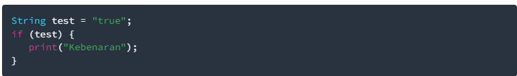

Apa yang terjadi ? Jika terjadi error, silakan perbaiki namun tetap menggunakan if/else.

Kode:

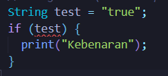

apabila dijalankan kode ini akan menghasilkan error yang menyatakan bahwa tipe data String tidak bisa ditugaskan ke variabel dengan tipe boolean. Untuk menghilangkan error tipe data String beserta valuenya harus diganti dengan menggunakan tipe data yang tepat yaitu bool serta value berupa false atau true.

Kode Setelah Perbaikan:

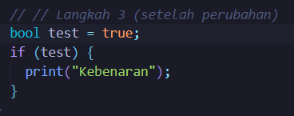

Hasil:

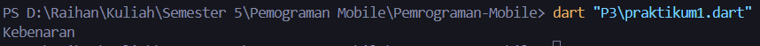

# Praktikum 2: Menerapkan Perulangan "while" dan "do-while"
**Langkah 1:**
Ketik atau salin kode program berikut ke dalam fungsi main().

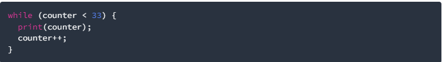

Kode:

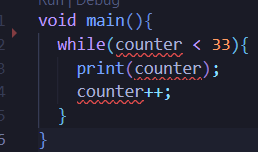

Kode ini ada kode program yang menggunakan loop while untuk melakukan perulangan hingga variabel yang ditugaskan memenuhi kondisi while. (pada kasus ini variabel yang ditugaskan adalah variabel counter)

**Langkah 2:**
Silakan coba eksekusi (Run) kode pada langkah 1 tersebut. Apa yang terjadi? Jelaskan! Lalu perbaiki jika terjadi error.

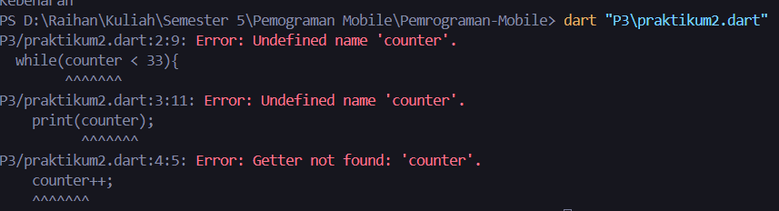

apabila dijalankan akan muncul error karena variabel counter belum terdefinisi. Untuk menghindari error perlu ditambahkan variabel bernama counter serta valuenya sebelum kode perulangan while tersebut.

Perbaikan Kode:

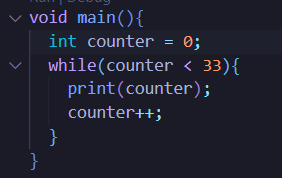

Hasil:

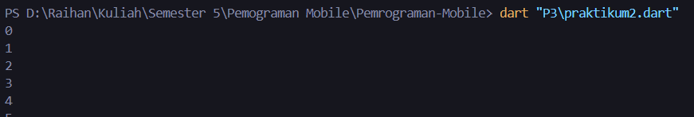

**Langkah 3:**
Tambahkan kode program berikut, lalu coba eksekusi (Run) kode Anda.

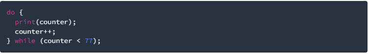

Apa yang terjadi ? Jika terjadi error, silakan perbaiki namun tetap menggunakan do-while.

Kode:

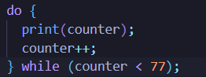

Hasil:

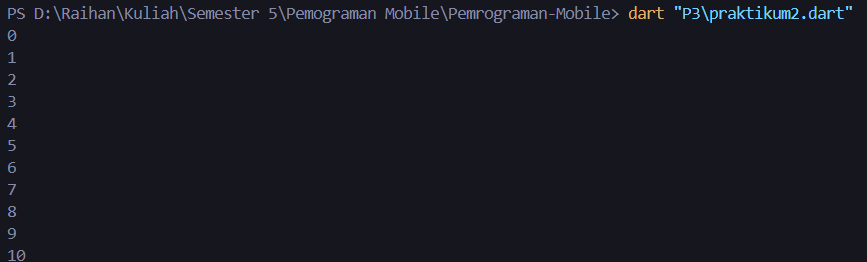

Dikarenakan variabel counter sudah terdefinisi kode ini tidak terjadi error.

# Praktikum 3: Menerapkan Perulangan "for" dan "break-continue"
**Langkah 1:**
Ketik atau salin kode program berikut ke dalam fungsi main().

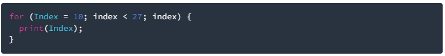

**Langkah 2:**
Silakan coba eksekusi (Run) kode pada langkah 1 tersebut. Apa yang terjadi? Jelaskan! Lalu perbaiki jika terjadi error.

**Langkah 3:**
Tambahkan kode program berikut di dalam for-loop, lalu coba eksekusi (Run) kode Anda.

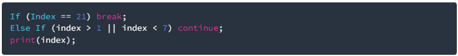

# Soal 2
Buatlah sebuah program yang dapat menampilkan bilangan prima dari angka 0 sampai 201 menggunakan Dart. Ketika bilangan prima ditemukan, maka tampilkan nama lengkap dan NIM Anda.

# Soal 3
Kumpulkan berupa link commit repo GitHub pada tautan yang telah disediakan di grup Telegram!