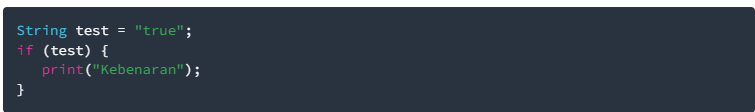
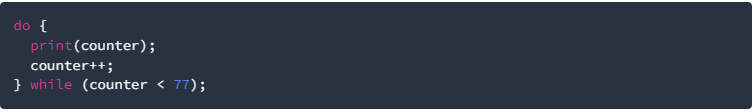

<table>
    <thead>
        <th style="text-align: center;" colspan="2">Pertemuan 2</th>
    </thead>
    <tbody>
        <tr>
            <td>Nama</td>
            <td>Raihan Fazzaufa Rasendriya</td>
        </tr>
        <tr>
            <td>NIM</td>
            <td>2241720201</td>
        </tr>
        <tr>
            <td>Kelas</td>
            <td>TI-3G</td>
        </tr>
        <tr>
            <td>Absen</td>
            <td>22</td>
        </tr>
    </tbody>
</table>

# **Tugas Praktikum**

# Soal 1
Silakan selesaikan Praktikum 1 sampai 3, lalu dokumentasikan berupa screenshot hasil pekerjaan beserta penjelasannya!

# Praktikum 1: Menerapkan Control Flows ("if/else")

**Langkah 1:**
Ketik atau salin kode program berikut ke dalam fungsi main().

**Langkah 2:**
Silakan coba eksekusi (Run) kode pada langkah 1 tersebut. Apa yang terjadi? Jelaskan!

**Langkah 3:**
Tambahkan kode program berikut, lalu coba eksekusi (Run) kode Anda.

# Praktikum 2: Menerapkan Perulangan "while" dan "do-while"
**Langkah 1:**
Ketik atau salin kode program berikut ke dalam fungsi main().

**Langkah 2:**
Silakan coba eksekusi (Run) kode pada langkah 1 tersebut. Apa yang terjadi? Jelaskan! Lalu perbaiki jika terjadi error.

**Langkah 3:**
Tambahkan kode program berikut, lalu coba eksekusi (Run) kode Anda.

# Praktikum 3: Menerapkan Perulangan "for" dan "break-continue"
**Langkah 1:**
Ketik atau salin kode program berikut ke dalam fungsi main().

**Langkah 2:**
Silakan coba eksekusi (Run) kode pada langkah 1 tersebut. Apa yang terjadi? Jelaskan! Lalu perbaiki jika terjadi error.

**Langkah 3:**
Tambahkan kode program berikut di dalam for-loop, lalu coba eksekusi (Run) kode Anda.

# Soal 2
Buatlah sebuah program yang dapat menampilkan bilangan prima dari angka 0 sampai 201 menggunakan Dart. Ketika bilangan prima ditemukan, maka tampilkan nama lengkap dan NIM Anda.

# Soal 3
Kumpulkan berupa link commit repo GitHub pada tautan yang telah disediakan di grup Telegram!