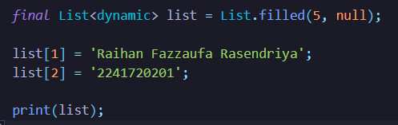
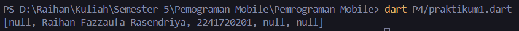
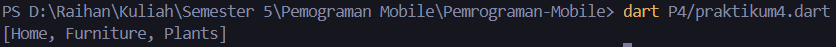

<table>
    <thead>
        <th style="text-align: center;" colspan="2">Pertemuan 2</th>
    </thead>
    <tbody>
        <tr>
            <td>Nama</td>
            <td>Raihan Fazzaufa Rasendriya</td>
        </tr>
        <tr>
            <td>NIM</td>
            <td>2241720201</td>
        </tr>
        <tr>
            <td>Kelas</td>
            <td>TI-3G</td>
        </tr>
        <tr>
            <td>Absen</td>
            <td>22</td>
        </tr>
    </tbody>
</table>

# Tugas Praktikum

# Soal 1
Silakan selesaikan Praktikum 1 sampai 5, lalu dokumentasikan berupa screenshot hasil pekerjaan Anda beserta penjelasannya!

# Praktikum 1: Eksperimen Tipe Data List

**Langkah 1**
Ketik atau salin kode program berikut ke dalam `void main()`.

```dart
var list = [1, 2, 3];
assert(list.length == 3);
assert(list[1] == 2);
print(list.length);
print(list[1]);

list[1] = 1;
assert(list[1] == 1);
print(list[1]);
```

Kode:


Kode ini merupakan sebuah program dart sederhana yang menggunakan list terlihat pada insialisasi pada baris kedua `var list = [1, 2, 3];`. fungsi `assert` digunakan untuk melakukan debugging dengan memeriksa kondisi tertentu saat menjalankan program. Apabila kondisi fungsi assert tidak terpenuhi maka program akan berhenti berjalan.

**Langkah 2**

Silakan coba eksekusi (Run) kode pada langkah 1 tersebut. Apa yang terjadi? Jelaskan!


Saat dieksekusi akan menampilkan angka 3 kemudian 2 kemudian 1. Angka 3 menyatakan panjang list. Angka 2 menyatakan nilai dari `list[1]`. Angka 1 mneyatakan nilai `list[1]` yang telah diubah dari 2 ke 1. 

**Langkah 3**

Ubah kode pada langkah 1 menjadi variabel final yang mempunyai index = 5 dengan default value = null. Isilah nama dan NIM Anda pada elemen index ke-1 dan ke-2. Lalu print dan capture hasilnya.

Apa yang terjadi ? Jika terjadi error, silakan perbaiki.

Kode:



Hasil:



Ketika menggunakan `final List<dynamic> list = list.filled(5, null);` Dart mengharuskan kita untuk mendeklarasikan list sebagai `final` sehingga tidak bisa mengubah referensi list, tetapi tetap bisa mengubah isinya. Pada kode ini terlihat bahwa list yang dibuat berukuran 5 dan diisi nilai null di dalamnya. Fungsi dari `List<dynamic>` dalam Dart adalah untuk membuat sebuah list yang elemen-elemennya dapat berisi nilai dari berbagai tipe data sehingga tidak terjadi error saat melakukan perubahan data dengan tipe yang berbeda. 

# Praktikum 2: Eksperimen Tipe Data Set

**Langkah 1**

Ketik atau salin kode program berikut ke dalam fungsi `main()`.

```dart
var halogens = {'fluorine', 'chlorine', 'bromine', 'iodine', 'astatine'};
print(halogens);
```

Kode:


Kode ini melakukan inisialisasi sebuah set di dart terlihat pada kode `var halogens = {'fluorine', 'chlorine', 'bromine', 'iodine', 'astatine'};`. Sesuai dengan kode set ini berisi lima buah elemen string.

**Langkah 2**

Silakan coba eksekusi (Run) kode pada langkah 1 tersebut. Apa yang terjadi? Jelaskan! Lalu perbaiki jika terjadi error.


Apabila kode tersebut dieksekusi akan menghasilkan hasil seperti gambar. hasil ini didapat dari penggunaan print pada baris ketiga kode langkah pertama.

**Langkah 3**

Tambahkan kode program berikut, lalu coba eksekusi (Run) kode Anda.

```dart
var names1 = <String>{};
Set<String> names2 = {}; // This works, too.
var names3 = {}; // Creates a map, not a set.

print(names1);
print(names2);
print(names3);
```

Apa yang terjadi ? Jika terjadi error, silakan perbaiki namun tetap menggunakan ketiga variabel tersebut. Tambahkan elemen nama dan NIM Anda pada kedua variabel Set tersebut dengan dua fungsi berbeda yaitu .add() dan .addAll(). Untuk variabel Map dihapus, nanti kita coba di praktikum selanjutnya.

Dokumentasikan code dan hasil di console, lalu buat laporannya.

Kode Awal:


Hasil: 


Terlihat saat eksekusi hasil terlihat kosong hanya berisi kurung saja ({}) namun tidak error. Apabila ingin hasil ada isinya bisa merubah kode sebagai berikut:


Hasil:


Kode dengan Tambahan elemen:


Hasil:


Kode dengan tambahan elemen tersebut memiliki dua data tipe Set yaitu`names1` dan `names2`. 
- `names1` adalah sebuah Set dengan tipe data `String`, dideklarasikan menggunakan var dengan inisialisasi kosong (`<String>{}`).

- `names2` juga merupakan Set dengan tipe `String`, dideklarasikan secara eksplisit menggunakan `Set<String>`.

fungsi metode `add` adalah untuk menambahkan hanya satu elemen ke dalam Set untuk setiap pemanggilan metode ini. Sedangkan metode `addall` diugnakan untuk menambahkan beberapa elemen sekaligus ke dalam set.

# Praktikum 3: Eksperimen Tipe Data Maps

**Langkah 1**

Ketik atau salin kode program berikut ke dalam fungsi `main()`.

```dart
var gifts = {
  // Key:    Value
  'first': 'partridge',
  'second': 'turtledoves',
  'fifth': 1
};

var nobleGases = {
  2: 'helium',
  10: 'neon',
  18: 2,
};

print(gifts);
print(nobleGases);
```

Kode:


Kode ini melakukan inisialisasi data tipe Map berupa `gifts` dan `nobleGases`. gifts menggunakan string sebagai kunci seperti `'first'` dan `'second'` dan mencampur tipe data nilainya, yaitu `string` berupa `('partridge', 'turtledoves')` dan `integer` berupa `1`. nobleGases menggunakan angka sebagai kunci seperti `2, 10, 18`, dengan nilai yang juga bervariasi antara string berupa `'helium', 'neon'` dan `integer` berupa `2`.

**Langkah 2**

Silakan coba eksekusi (Run) kode pada langkah 1 tersebut. Apa yang terjadi? Jelaskan! Lalu perbaiki jika terjadi error.


Apabila dieksekusi kode ini akan menampilkan isi dari variabe; map yang telah dibuat. hasil tersebut didapatkan dari `print` yang ditulis pada kode.

**Langkah 3**

Tambahkan kode program berikut, lalu coba eksekusi (Run) kode Anda.

```dart
var mhs1 = Map<String, String>();
gifts['first'] = 'partridge';
gifts['second'] = 'turtledoves';
gifts['fifth'] = 'golden rings';

var mhs2 = Map<int, String>();
nobleGases[2] = 'helium';
nobleGases[10] = 'neon';
nobleGases[18] = 'argon';
```

Apa yang terjadi ? Jika terjadi error, silakan perbaiki.

Kode:


Hasil:


Saat dieksekusi terjadi perubahan pada isi dari variabel map `gifts` dan `nobleGases`. Untuk variabel map `mhs1` dan `mhs2` tidak ada isi karena masih belum diberikan sebuah elemen (nilai) di dalamnya.

Tambahkan elemen nama dan NIM Anda pada tiap variabel di atas (gifts, nobleGases, mhs1, dan mhs2). Dokumentasikan hasilnya dan buat laporannya!

Kode:


Hasil:


Untuk menambahkan elemen nama dan NIM pada tiap variabel perlu ditambahkan key pada [] suatu varibel dan valuenya. Untuk variabel `gifts` dan `mhs1` menggunakan key dengan tipe `string` dan value dengan tipe `string`. Untuk variabel `nobleGases` dan `mhs2` terutama `mhs2` menggunakan key dengan tipe `int` dan value dengan tipe `string`.

# Praktikum 4: Eksperimen Tipe Data List: Spread dan Control-flow Operators

**Langkah 1**

Ketik atau salin kode program berikut ke dalam fungsi `main()`.

```dart
var list = [1, 2, 3];
var list2 = [0, ...list];
print(list1);
print(list2);
print(list2.length);
```

Kode:


Kode ini melakukan inisialisasi variabel list berupa `list` dan `list2`. list berisi tiga elemen yaitu `[1, 2, 3]` sedangkan list2 berisi 4 elemen yaitu `0` diikuti oleh isi dari variabel `list`.

**Langkah 2**

Silakan coba eksekusi (Run) kode pada langkah 1 tersebut. Apa yang terjadi? Jelaskan! Lalu perbaiki jika terjadi error.


Sat dieksekusi kode akan menampilkan isi dari variabel `list` dan `list2` selain itu kode juga akan menampilkan panjang variabel `list2` sesuai dengan `print` pada kode yang telah dibuat.

**Langkah 3**

Tambahkan kode program berikut, lalu coba eksekusi (Run) kode Anda.

```dart
list1 = [1, 2, null];
print(list1);
var list3 = [0, ...?list1];
print(list3.length);
```

Apa yang terjadi ? Jika terjadi error, silakan perbaiki.

Tambahkan variabel list berisi NIM Anda menggunakan Spread Operators. Dokumentasikan hasilnya dan buat laporannya!


Apabila menambahkan kode tersebut dan menjalankannya akan terjadi error. Berikut adalah perbaikan kode tersebut:

Perbaikan Kode:


Hasil Perbaikan:


Perbaikan kode adalah berupa penambahan tipe data sebelum nama variabel `list1` penambahan tersebut berupa tipe `dynamic` (`var` juga bisa namun lebih baik `dynamic`).

Kode dengan tambahan variabel:


Hasil dengan tambahan variabel:


tambahan variabel diinisialisasi kemudian dimasukkan ke dalam variabel `list3` dengan kode program seperti pada gambar menyatakan bahwa tambahan variabel berupa NIM sudah ditambahkan menggunakan Spread Operators.

**Langkah 4**

Tambahkan kode program berikut, lalu coba eksekusi (Run) kode Anda.

```dart
var nav = ['Home', 'Furniture', 'Plants', if (promoActive) 'Outlet'];
print(nav);
```

Apa yang terjadi ? Jika terjadi error, silakan perbaiki. Tunjukkan hasilnya jika variabel `promoActive` ketika `true` dan `false`.

Akan terjadi error akibat promoActive yang tidak didefinisi. Perbaikan programnya adalah sebagai berikut:

Kode Perbaikan:


Dengan menambahkan inisialisasi untuk promoActive, kode akan berjalan dengan benar dengan hasil sebagai berikut:

Hasil apabila `promActive = true`:


Hasil apabila `promoActive = false`:



**Langkah 5**

Tambahkan kode program berikut, lalu coba eksekusi (Run) kode Anda.

```dart
var nav2 = ['Home', 'Furniture', 'Plants', if (login case 'Manager') 'Inventory'];
print(nav2);
```

Apa yang terjadi ? Jika terjadi error, silakan perbaiki. Tunjukkan hasilnya jika variabel login mempunyai kondisi lain.

Akan terjadi error akibat variabel login yang tidak didefinisi. Perbaikan programnya adalah sebagai berikut:


Dengan menambahkan inisialisasi untuk login, kode akan berjalan dengan benar dengan hasil sebagai berikut:

Hasil apabila `login = 'Manager'`:


Hasil apabila `login` bernilai lainnya:


**Langkah 6**

Tambahkan kode program berikut, lalu coba eksekusi (Run) kode Anda.

```dart
var listOfInts = [1, 2, 3];
var listOfStrings = ['#0', for (var i in listOfInts) '#$i'];
assert(listOfStrings[1] == '#1');
print(listOfStrings);
```

Apa yang terjadi ? Jika terjadi error, silakan perbaiki. Jelaskan manfaat Collection For dan dokumentasikan hasilnya.

Kode:


Hasil:


Tidak terjadi error. Kode tersebut digunakan untuk membuat sebuah list `listOfString` yang dibuat menggunakan list comprehension dengan menambah elemen `'#0` sebagai elemen pertama kemudian diikuti oleh iterasi perulangan yang menggunakan `listOfInts`. Kemudian `listOfString` dilakukan pengecekan menggunakan method `assert` dan apabila dicek sudah benar maka akan diprint.

# Praktikum 5: Eksperimen Tipe Data Records

**Langkah 1**

Ketik atau salin kode program berikut ke dalam fungsi `main()`.

```dart
var record = ('first', a: 2, b: true, 'last');
print(record)
```

Kode:


**Langkah 2**

Silakan coba eksekusi (Run) kode pada langkah 1 tersebut. Apa yang terjadi? Jelaskan! Lalu perbaiki jika terjadi error.

Tidak terjadi error namun cara inisialisasi variabel `record` yang menggunakan tipe data record terkadang kurang jelas. Oleh karena itu, kode ini bisa diganti menjadi map.

Perbaikan kode:


Hasil:


**Langkah 3**

Tambahkan kode program berikut di luar scope `void main()`, lalu coba eksekusi (Run) kode Anda.

```dart
(int, int) tukar((int, int) record) {
  var (a, b) = record;
  return (b, a);
}
```

Apa yang terjadi ? Jika terjadi error, silakan perbaiki. Gunakan fungsi `tukar()` di dalam `main()` sehingga tampak jelas proses pertukaran value field di dalam Records.

Tidak ada error saat dijalankan dan tidak tampil apapun karena fungsi tersebut tidak dipakai. 
Penggunaan fungsi tukar() di dalam main():


Hasil Penggunaan:


Kode ini mendefinisikan fungsi `tukar` yang menerima sebuah tuple yang terdiri dari dua integer dan mengembalikannya dalam urutan terbalik.

**Langkah 4**

Tambahkan kode program berikut di dalam scope `void main()`, lalu coba eksekusi (Run) kode Anda.

```dart
// Record type annotation in a variable declaration:
(String, int) mahasiswa;
print(mahasiswa);
```

Apa yang terjadi ? Jika terjadi error, silakan perbaiki. Inisialisasi field nama dan NIM Anda pada variabel record `mahasiswa` di atas. Dokumentasikan hasilnya dan buat laporannya!

Kode ini apabila langsung dieksekusi akan terjadi error. Error tersebut karena variabel `mahasiswa` tidak boleh null. Berikut adalah perbaikan kode tersebut:


Hasil:


Kode tersebut melakukan inisialisai sebuah variabel mahasiswa dengan tipe `tuple (String, int)` yang berarti menyimpan dua elemen yaitu `String` dan `int`. Elemen tersebut setelah perbaikan telah terisi menggunakan nilai `'Raihan Fazzaufa Rasendriya'` dan `2241720201`.

**Langkah 5**

Tambahkan kode program berikut di dalam scope void `main()`, lalu coba eksekusi (Run) kode Anda.

```dart
var mahasiswa2 = ('first', a: 2, b: true, 'last');

print(mahasiswa2.$1); // Prints 'first'
print(mahasiswa2.a); // Prints 2
print(mahasiswa2.b); // Prints true
print(mahasiswa2.$2); // Prints 'last'
```

Apa yang terjadi ? Jika terjadi error, silakan perbaiki. Gantilah salah satu isi record dengan nama dan NIM Anda, lalu dokumentasikan hasilnya dan buat laporannya!

Hasil:


Saat dieksekusi tidak terjadi error kode berjalan dengan baik.

Kode dengan penggantian isi record:


Hasil:


Kode ini melakukan inisialisasi sebuah `tuple` dengan nama `mahasiswa2` dengan kombinasi elemen yang terindeks dan diberi nama. `tuple` ini berisi empat elemen yaitu:
- `'Raihan Fazzaufa Rasendriya'` yang sebelumnya bernilai `'first'` yang bisa diakses melalui `.$1`.
- `2241720201` yang sebelumnya bernilai `2` yang bisa diakses melalui `.a` (melalui nama).
- `true` yang bisa diakses melalui `.b` (melalui nama).
- `'last'` yang bisa diakses melalui `.$2`.

# Soal 2
Jelaskan yang dimaksud Functions dalam bahasa Dart!

Functions adalah blok code yang dapat dijalankan berulang kali dan memungkinkan untuk mengelompokkan logika menjadi bagian yang lebih kecil dan terstruktur. Fungsi dideklarasikan dengan tipe data pengembalian atau tanpa pengembalian (void), nama, dan parameter (opsional) yang dapat digunakan di dalam tubuh function.

# Soal 3
Jelaskan jenis-jenis parameter di Functions beserta contoh sintaksnya!

1. Positional Parameter

Positional parameter adalah parameter yang diharuskna berada dalam urutan tertentu saat memanggil fungsi.

contoh:

```dart
void greet(String name, int age) {
  print('Hello $name, you are $age years old.');
}

void main() {
  greet('John', 25);  // Output: Hello John, you are 25 years old.
}
```

2. Named Parameter

Named parameter digunakan untuk memberikan nilai parameter dengan menyebutkan nama parameter tersebut. Ini memberikan fleksibilitas pada urutan parameter.

contoh:

```dart
void greet({required String name, required int age}) {
  print('Hello $name, you are $age years old.');
}

void main() {
  greet(name: 'Alice', age: 30);  // Output: Hello Alice, you are 30 years old.
}
```

3. Default Parameter

Default Parameter adalah named parameter atau positional parameter yang diberi nilai default. Jika tidak ada nilai yang diberikan, maka parameter akan menggunakan nilai default tersebut.

contoh:

```dart
void greet({String name = 'Guest', int age = 18}) {
  print('Hello $name, you are $age years old.');
}

void main() {
  greet();  // Output: Hello Guest, you are 18 years old.
  greet(name: 'David');  // Output: Hello David, you are 18 years old.
  greet(name: 'David', age: 35);  // Output: Hello David, you are 35 years old.
}
```

4. Optional Positional Parameter

Optional Positional Parameter adalah positional parameter yang dibuat opsional dengan menambahkan tanda kurung siku ([]). Jika parameter tidak diberikan, nilainya adalah null.

contoh:

```dart
void greet(String name, [int? age]) {
  if (age != null) {
    print('Hello $name, you are $age years old.');
  } else {
    print('Hello $name.');
  }
}

void main() {
  greet('Bob');  // Output: Hello Bob.
  greet('Bob', 28);  // Output: Hello Bob, you are 28 years old.
}
```

# Soal 4
Jelaskan maksud Functions sebagai first-class objects beserta contoh sintaknya!

function dianggap sebagai first-class object maksudnya adalah function dapat diperlakukan seperti object lain dalam bahasa tersebut. Function bisa diperlakukan sebagai berikut:

- Disimpan dalam variabel

```dart
void sayHello() {
  print('Hello!');
}

void main() {
  var greet = sayHello;  // Menyimpan fungsi dalam variabel
  greet();  // Memanggil fungsi melalui variabel
}
```

- Diberikan sebagai argumen ke function lain.

```dart
void performOperation(int a, int b, Function operation) {
  print(operation(a, b));
}

int add(int a, int b) {
  return a + b;
}

void main() {
  performOperation(3, 4, add);  // Fungsi `add` diberikan sebagai argumen
  // Output: 7
}
```

- Dikembalikamn dari function lain.

```dart
Function multiplier(int factor) {
  return (int x) => x * factor;
}

void main() {
  var triple = multiplier(3);  // Mendapatkan fungsi yang mengalikan dengan 3
  print(triple(5));  // Output: 15
}
```

- Disimpan dalam struktur data seperti data seperti daftar (list) atau peta (map).

```dart
void sayHello() {
  print('Hello!');
}

void sayGoodbye() {
  print('Goodbye!');
}

void main() {
  var actions = [sayHello, sayGoodbye];  // Menyimpan fungsi dalam list
  
  actions[0]();  // Memanggil fungsi pertama
  actions[1]();  // Memanggil fungsi kedua
}
```


# Soal 5
Apa itu Anonymous Functions? Jelaskan dan berikan contohnya!

Anonymous Functions adalah fungsi yang tidak memiliki nama. Function ini biasanya digunakan ketika sebuah fungsi hanya dibutuhkan untuk sementara waktu. Anonymous Functions sering digunakan dalam Dart untuk operasi singkat atau lambdas.

Di Dart, anonymous function dideklarasikan menggunakan keyword `function` biasa, tetapi tanpa nama, atau bisa juga menggunakan **arrow syntax** (`=>`) jika fungsinya hanya terdiri dari satu ekspresi.

contoh:

1. Anonymous Function Biasa

```dart
void main() {
  var list = ['apple', 'banana', 'orange'];

  list.forEach((item) {
    print(item);  // Anonymous function digunakan di sini
  });
}
```

2. Anonymous Function dengan Arrow Syntax

```dart
void main() {
  var list = ['apple', 'banana', 'orange'];

  list.forEach((item) => print(item));  // Menggunakan arrow syntax
}
```
3. Anonymous Function dalam variabel
```dart
void main() {
  var multiply = (int a, int b) {
    return a * b;
  };

  print(multiply(3, 4));  // Output: 12
}
```

4. Anonymous Function sebagai Argumen
```dart
void main() {
  var numbers = [1, 2, 3, 4, 5];
  
  var doubledNumbers = numbers.map((num) => num * 2).toList();
  
  print(doubledNumbers);  // Output: [2, 4, 6, 8, 10]
}
```
 
# Soal 6
Jelaskan perbedaan Lexical scope dan Lexical closures! Berikan contohnya!
- Lexical Scope

Lexical Scope adalah aturan yang menentukan di mana variabel dapat diakses berdasarkan lokasi kode pada saat kompilasi. Dart menggunakan lexical scoping, yang berarti variabel hanya dapat diakses dalam ruang lingkup tempat variabel tersebut.

contoh:

```dart
void outerFunction() {
  var outerVariable = 'Hello';

  void innerFunction() {
    print(outerVariable);  // Mengakses variabel di scope luar
  }

  innerFunction();  // Output: Hello
}

void main() {
  outerFunction();
}
```

- Lexical Closure

Lexical closure adalah fungsi yang mengikat (capture) variabel dari lingkup di mana fungsi itu dideklarasikan. Dengan closure, fungsi dapat "mengingat" dan menggunakan variabel-variabel dari lingkup sekitarnya, meskipun lingkup tersebut sudah dieksekusi. 

Closure memungkinkan sebuah fungsi tetap memiliki akses ke variabel di lingkup luar, bahkan setelah lingkup luar itu selesai dieksekusi. Closure menggabungkan fungsi dan lingkungan (environment) tempat fungsi itu dideklarasikan.

contoh:
```dart
Function outerFunction() {
  var outerVariable = 'Hello';

  return () {
    print(outerVariable);  // Mengakses variabel dari scope luar
  };
}

void main() {
  var closureFunction = outerFunction();  // outerFunction selesai, tetapi closureFunction masih "ingat" outerVariable
  closureFunction();  // Output: Hello
}
```

# Soal 7
Jelaskan dengan contoh cara membuat return multiple value di Functions!

1. Menggunakan List

```dart
List<int> getCoordinates() {
  int x = 10;
  int y = 20;
  return [x, y];  // Mengembalikan nilai dalam List
}

void main() {
  var coordinates = getCoordinates();
  print('X: ${coordinates[0]}, Y: ${coordinates[1]}');
}
```

2. Menggunakan Map

```dart
Map<String, int> getDimensions() {
  int width = 100;
  int height = 200;
  return {'width': width, 'height': height};  // Mengembalikan nilai dalam Map
}

void main() {
  var dimensions = getDimensions();
  print('Width: ${dimensions['width']}, Height: ${dimensions['height']}');
}
```

3. Menggunakan Tuple dari Package

```dart
import 'package:tuple/tuple.dart';

Tuple2<int, int> getCoordinates() {
  return Tuple2(10, 20);  // Mengembalikan dua nilai dalam Tuple
}

void main() {
  var coordinates = getCoordinates();
  print('X: ${coordinates.item1}, Y: ${coordinates.item2}');
}
```

4. Menggunakan Custom Class

```dart
class Point {
  final int x;
  final int y;

  Point(this.x, this.y);
}

Point getPoint() {
  return Point(10, 20);  // Mengembalikan objek dari class Point
}

void main() {
  var point = getPoint();
  print('X: ${point.x}, Y: ${point.y}');
}
```

5. Menggunakan Destructuring dengan List

```dart
List<int> getNumbers() {
  return [1, 2, 3];
}

void main() {
  var numbers = getNumbers();
  var first = numbers[0];
  var second = numbers[1];
  var third = numbers[2];
  
  print('First: $first, Second: $second, Third: $third');
}
```

# Soal 8
Kumpulkan berupa link commit repo GitHub pada tautan yang telah disediakan di grup Telegram!